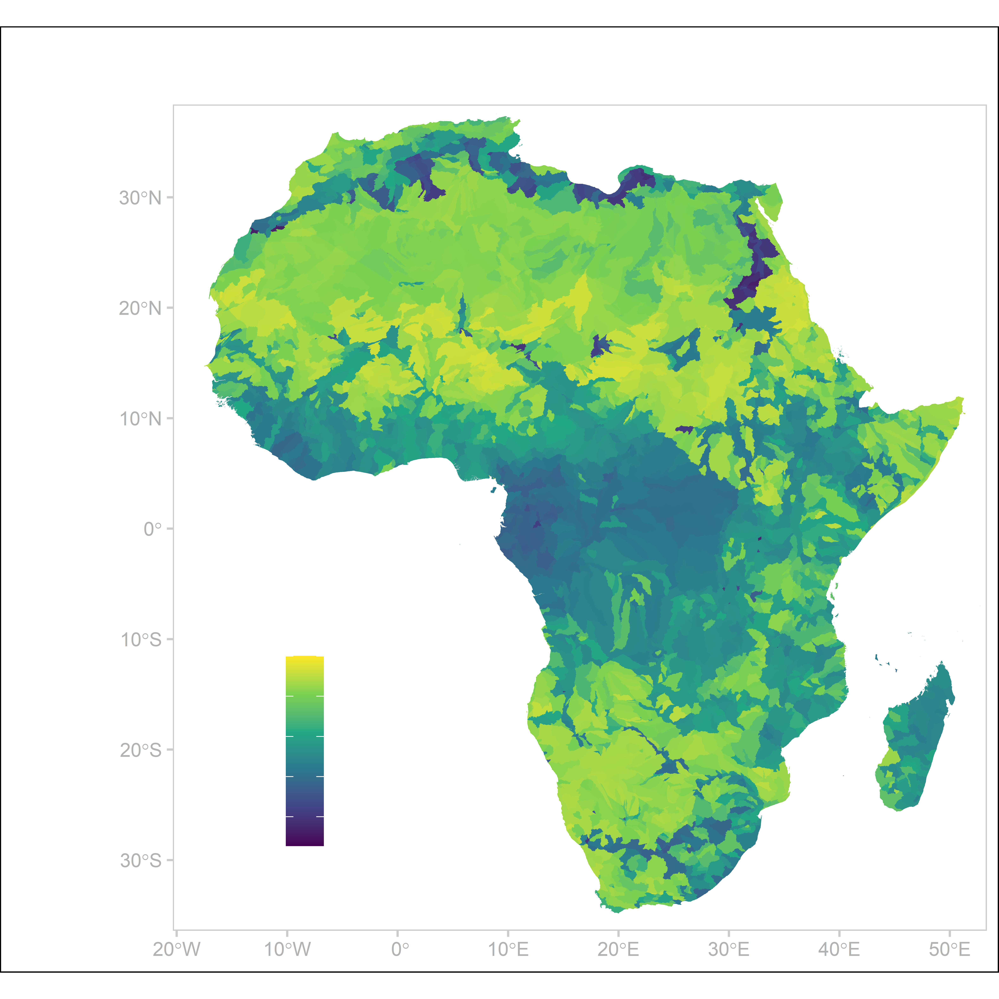
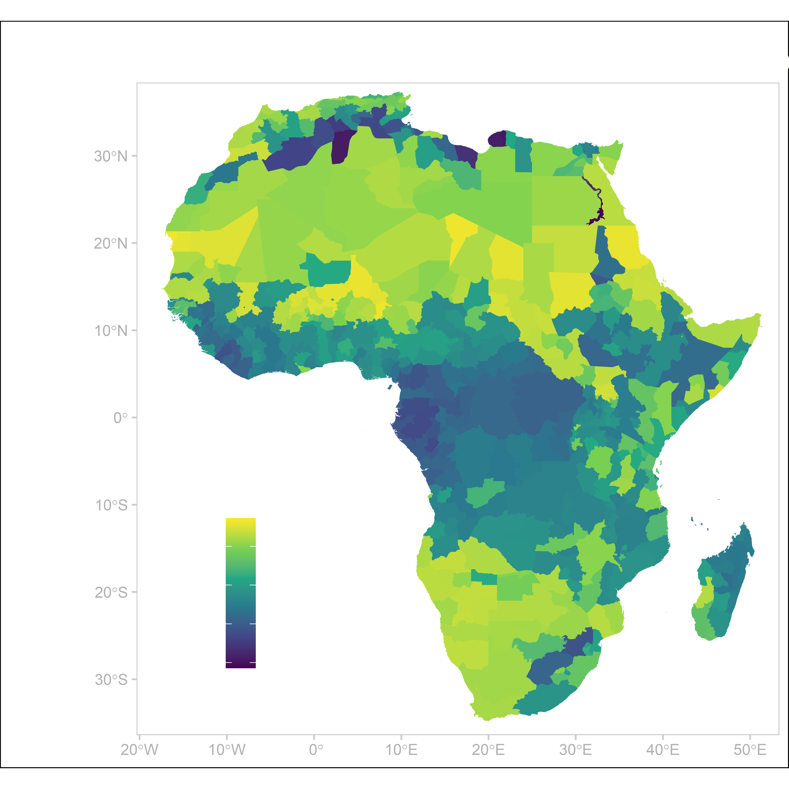

# ClimateChangeAndConflict

## Conflict in Africa 

Figure 1: Development of Protests and Riots in different Regions in Africa between 1997 and 2021. Calculated with Armed Conflict & Event Location Dataset based on a Poisson regression model.

## Water Stress
From the [Aqueduct 3.0](https://www.wri.org/research/aqueduct-30-updated-decision-relevant-global-water-risk-indicators) Dataset Figure 2 and 3 show the raw data of the baseline water stress and the water stress for the agricultural industry. For the latter index, 13 water related indicators have been weighted to the more accurately describe the water stress for the agricultural industry. More on the methodology is in the [documentation for Aqueduct 3.0](https://files.wri.org/d8/s3fs-public/aqueduct-30-updated-decision-relevant-global-water-risk-indicators_1.pdf). 

  
   

The Aqueduct 3.0 has the geomeotry type of Multipolygon, which is not compatible with other datasets. Therefore, I restructed the Aqueduct to fit onto [districts](https://www.naturalearthdata.com/downloads/10m-cultural-vectors/10m-admin-1-states-provinces/). Which is also useful for adding political variables.

  
   

## Catastrophes

## Additional Variables

## Models

## Predictions

## Results
